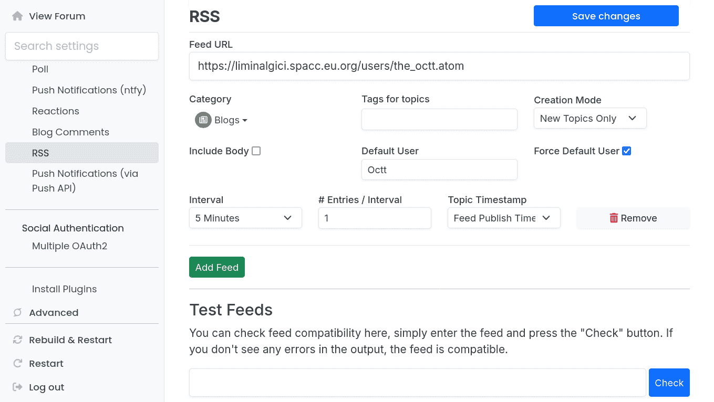

# NodeBB RSS Parser Super

This NodeBB plugin pulls RSS feeds and creates topics in predefined categories. This is a fork of [barisusakli/nodebb-plugin-rss](https://github.com/barisusakli/nodebb-plugin-rss) which adds a number of super features and improvements.

To customize options for the parser, please consult the "RSS" page in the administration panel, under the "Plugins" heading.

## Installation

    npm install nodebb-plugin-rss-super

or

    git+https://gitlab.com/SpaccInc/nodebb-plugin-rss-super.git

## Usage

 

1. Click "Add Feed"
2. Enter the RSS feed you want to pull
3. Select the category you want to post to
4. Type in the username you want to post as, when not available from the feed
5. Select the interval to query the RSS feed
6. Fill in the other (optional) fields as desired
7. Click "Save changes"
